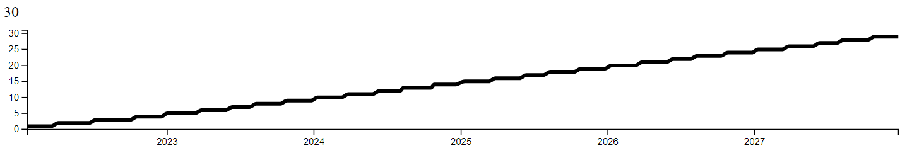

# Getting Started

Want to start making your next stats video with Statical? This is the perfect place to start! In this tutorial, we'll make a simple example with a number and line graph.

You can also [view this example on GitHub](https://github.com/SCToolsOrg/statical/blob/main/example.html).

## Installation

You can install Statical by using npm:

Or use a CDN such as [unpkg](https://unpkg.com):

```js
<script src="https://unpkg.com/@sctools/statical/statical.js"></script>
```

Or [download it straight from the source](https://github.com/SCToolsOrg/statical/releases/latest).

## Usage

To use Statical, just write a few lines of JavaScript:

```html
<!DOCTYPE html>
<html lang="en">
  <head>
    <meta charset="UTF-8" />
    <meta name="viewport" content="width=device-width, initial-scale=1.0" />
    <script src="https://d3js.org/d3.v7.min.js"></script>
  </head>
  <body>
    <div id="count">0</div>
    <div id="chart"></div>
  </body>
  <script src="./statical.js"></script>
  <script>
    // this can come from an external script, such as "./data.js"
    const data = {
      dates: [
        "2022-01-01",
        "2023-01-01",
        "2024-01-01",
        "2025-01-01",
        "2026-01-01",
        "2027-01-01",
        "2028-01-01",
      ],
      count: [1, 5, 10, 15, 20, 25, 30],
    };

    var dates = data.dates.map((date) => new Date(date));
    var DPMS = (5 * 1000) / dates.length;
    var charts = {
      chart: {
        style: {
          width: 920,
          height: 105,
          marginLeft: 25,
          marginTop: 10,
          marginBottom: 25,
          marginRight: 25,
        },
        lines: {
          color: "black",
        },
      },
    };
    var valueTypes = {
      count: (val) => val.toLocaleString(),
    };

    function update() {
      animateValue("count", data.count[pastIndex], data.count[index]);
    }

    function animateCharts() {
      updateChart("chart", parseInt(getText("count")));
    }
  </script>
</html>
```

This will give us a number and a line graph!



## Styling

You may notice that the example above has no styles. You can always style your videos using CSS.

We don't control how the layout of your video looks, **_you do_**.
